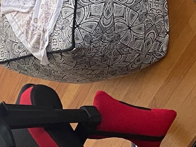

# Engineering_4_Notebook
## Dice Roller
### Description
This assignment was to simulate a dice being rolled on our raspberry pi. This assignment utilized a while loop and a random.
### Reflection 
This assignment was a struggle for me because python is by no means my strong suit and I have been coding in java for the past two months so it gonna take some getting used too to get back into the swing. The only difference is the syntax is a little different but the logic is the same. I did need a little help from jude though.
## Calculator
### Description
The objective of this assignment was to create a program that uses functions and allows the user to add, subtract, multipy, divide, and mod.
### Reflection
The main problem I ran into was actually organizing my code and getting us to the syntax of indenting and what not. This was difficult for me because in java you can use brackets to organize your code making it alot cleaner. A solution I had was to put the functions at the top and group them together so it is easier tofind them and less messy.
## Quadratic Solver
### Description
The objective of this assignment was to create a program that would find the real roots of a simple mathmatic quadratic equation while detecting if there were and imaginary roots. The program did this by finding the discriminant.
### Reflection
This assignment wasn't too hard. Mainly cause I kinda got the hang of functions and understand how exactly they work. I definitely could have made my code alot more consice by using one function instead of three but I didn't want to risk meeing the single function up just incase it got too complicated. I used a sperated function for the discriminant just because it allowed me to reject the imaginary roots a little easier. I also have started coding on JDOODLE, a free IDE that we use for my CS class. It allows me to save my work really easily and makes debugging and executing alot quicker as well.
## Strings and loops
### Description
The main goal of this assignment was to create a program that splits up a sentence letter by letter and prints each on a different line, it also uses dashes to show the spaces. 
### Reflection
This assignment allowed me to use my new found function skills and really put them too the test. By doing this I use a single function the Split up the Words first using a split() and then use another split() to split up the words. I also use 2 for loops insinde the function that allowed the function to keep looping. To replace the spaces I drew inspiration from Graham Lenert and used a replace(), this allows you to input the thing you want to replace and the item your replacing it with, like this, b=b.replace("a", "x"), This would replace all A's for x's inside the B. I once again used Jdoodle to write my code then transfered it too beagle term. I would recommend using a separate IDE for these assignment, I just streamlines the process a bit.
## MSP
### Description
Essentially make a hangman program using the various skills we have learned so far.
### Reflection
The main idea of the assignment wasn't very hard and was a great exersize to incorperate our skills we have learned so far. The main trouble I ran into was the printing of the actual hangman. This could have been done alot easier ways than I did it, probably with an array or array list. But I just hard coded it. Definitely wasn't the moves but thats OK. This assignment was also great to use replit on and allowed me to collaborate in real time with classmates. 
## SSH
### Description
The purpose of this assignment was to set up SSH and get a feel for it. The goal was to wire up an LED and make it blink using the program.
### Reflection
Setting up SSH was a pain. I took a while to figure out why my IP was wrong and it was because I typed in hostname -i instead of hostname -I. So that took me the longest time to figure out. Then once I finally tried to connect to SSH I found out that my pi was offline and I couldn't connect to the internet because my wpa supplicant file was broken so I had to delete some file the reboot my pi. Finally I was onto the coding and wiring part. This was fairly simple but I didn't know how to use the battery so I ended up just connecting my pi with the other provided cable. I figured out the gpio pins by just googling guide and the images were very helpful. In all honesty this assignment took me alot longer than it should have.
### Video if it will work

## GPIO PINS - Python
### Description
Make 2 LEDs blink using your raspberry pi.
### Reflection
This assignment was a breeze because all I had to do was wire up another LED and it took me like 10 Seconds. You can use the exact same code from SSH assignment.
### Video if it will work

## Bash
### Description
This assignment served as intro to bash. WE were to blink to LEDs ten times using bash.
### Reflection
This was a refreshing assignment as we use something new, BASH. USing bash was kinda wierd at first but one of my fellow classmates Graham lenert has two links in his repo that help to guide you through the process. Running the code was easy. This assignment didn't take long because it used the same wiring for the last two assignments. I'm not a big fan of the gpio pins, I think they are overly complicated.
## Hello Flask
### Description
This assignment setup Flask.
### Reflection
I took a break from I2C to do this. This assignment was a breeze and added a sick feature to my arsenal. I wonder what the other applications of this could be. This assignment also featured the best directions thus far. Thx Dr. Shields. 

## Gpio pins Flask
### Description
This assignment had us turn an LED on and off wirelessly with a different computer.
### Reflection
I got stuck on I2C so I decided to satrt this assignment. It wasn't too hard, but it does introduce a very key component that will help with our project, the flask app. With this we will be able to do all sorts of fancy things with our pi. I also like the HTML part because HTML is a really cool language and this assignment helped be brush back up on it. The format of the buttons was a little tricky so I got some inspiration from my classmates. I did run into one issue, I kept trying to run the code with python3 instead of sudo python, very stupid mistake.

## I2C
### Description
This assignment had us setup, use, and familiarize ourselves with the accelerometer. Also used a display.
### Reflection
This assignment was a long time coming. First I put this assignment off because it wouldn't allow me to turn on I2C. Then I had to get a new accelerometer. The whole process was very buggy for me. I liked how this assignment utilized the wiring/hardware side that the rest of these assginments didn't really use to the fullest. Since this assignment was pretty old I was able to use the knowlegde my peers passed do to me to the fullest. The main problem I ran into was formatting. And a very helpful take away from this assignment was formatting ;). As well as how to use and accelerometer which will be helpful because me plan on using one for our project.

## Headless
### Description 
For this assingment I was tasked with running basically the previous assignment and graphing that visually. Then we were tasked with either having it automatically running on startup or using ssh to run the program. All in all you had a bit of freedom with this assignment.
### Reflection
It has been a real pain to do these assignment while working on my project but I guess thats what I get for procrastinating this. I choose to go the ssh way cause for some reason I just like the ssh interface and whatnot. But all in all I did use a couple new things: I Made a scatterplot appear visual (The poin of the assignment), Use it to display one of 3 vairables. I really dont know what else to put as this is a pretty old assignment and my classmates wiki's solved most of the minor issues I ran into. 
### Fritzing
I Will add fritzing when I get to school.

## Pi Camera
### Description
For this assignment we hooked up a camera, wired it, and used it to take pictures using our raspberry pi. For the second part of this assignment 
### Reflection
I had a lot of fun with this assignment. I really like feature and hope to use it next year in my capstones project. This assignment wasa sort of straight forward and allowed me to kinda do my own thing. Luckliy I had my peers to help me with the code so I was really just struggling on the set up. I ran into a few problems with my pi not reading my camera so I had to borrow a friends camera. I decided to use the resolution 1024,768. For the second part we had to add filters to our pictures. This process was mapped out by my peers so it was a pretty simple task.
### Pictures

Might have gotten cropped a little bit.

